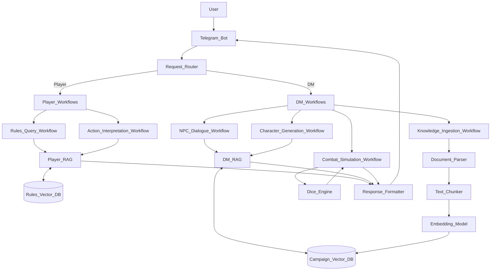

# D&D Assistant — Интеллектуальный помощник для мастеров и игроков Dungeons & Dragons

**D&D Assistant** — это Telegram-бот, созданный, чтобы облегчить ведение и участие в сессиях Dungeons & Dragons 5e. Вместо обычной LLM, бот использует workflow-механизмы и RAG (Retrieval-Augmented Generation), чтобы давать ответы, строго основанные на правилах, лоре кампании и текущем контексте игры.

---

## Ключевые функции

### Для игроков:
- Быстрые и точные ответы по правилам D&D 5e (SRD, XGtE, TCoE и др.).
- Помощь в интерпретации действий персонажа в сложных ситуациях.

### Для Мастеров Игры:
- **Реплики NPC**: генерация диалогов с учётом характера, мотивации и игровой ситуации (задаются через промты).
- **База знаний кампании**: хранение и быстрый доступ к лору, домашним правилам, локациям, ключевым NPCs и механикам.
- **Симуляция боёв**: автоматический прокидывание инициативы, атак, урона и реакций NPC — минимум рутины для DM.
- **Генерация персонажей**: создание готовых листов персонажей как для игроков (по параметрам), так и для NPC (с учётом баланса и ролевой функции).

---

## Как это работает?

1. Входящий запрос анализируется и обогащается через **RAG**:
   - Извлекается релевантная информация из официальных правил и пользовательской базы знаний.
2. Запускается **workflow-конвейер**:
   - Определяется тип запроса (правила, NPC, бой, генерация и т.д.).
   - Выполняются необходимые шаги: кубики, проверки, выбор шаблона, формирование ответа.
3. Формируется структурированный, точный и контекстный ответ — без вымысла.

Это обеспечивает **предсказуемость**, **соответствие правилам** и **минимум галлюцинаций**.

---
## Архитектура пайплайна и взаимодействие компонентов


## Данные

Проект использует структурированный датасет, подготовленный специально для D&D-ассистента:

- **Hugging Face Dataset**: [mixlizer/for_dnd_assistant](https://huggingface.co/datasets/mixlizer/for_dnd_assistant)

Загрузить локально:
```python
from datasets import load_dataset
dataset = load_dataset("mixlizer/for_dnd_assistant")
```


## Использованный стек
- Python 3.10+
- Telegram Bot: aiogram
- RAG: LangChain
- Vector DB: Qdrant
- Embeddings: Sentence Transformers
- Document Parsing: unstructured, pypdf
- Backend: FastAPI

