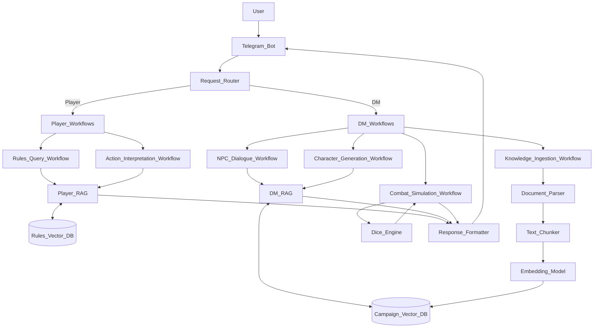

# ML System Design Doc - [RU]
## Дизайн ML системы - DND-assistant MPV
### 1. Цели и предпосылки
#### 1.1. Зачем идем в разработку продукта?

- **Бизнес-цель**

Сократить суммарное время подготовки и ведения сессии Dungeons & Dragons на 30–40 % для мастеров и на 20 % для игроков, одновременно повышая удовлетворённость (NPS ≥ 60) благодаря автоматизации рутинных задач.
- **Почему станет лучше, чем сейчас, от использования ML**

Модели LLM и retrieval-системы позволяют автоматически интерпретировать свободный текст игроков, подбирать релевантные правила и мгновенно генерировать сцены, NPC и сюжетные ветки, адаптируясь к стилю конкретного мастера. Без ML пришлось бы вручную готовить библиотеки сюжетов и вести справку, что не масштабируется и не реагирует на контекст в реальном времени. ML-подход обеспечивает персонализацию, консистентность лора и оперативный расчёт бросков/эффектов, снижая когнитивную нагрузку на участников и освобождая время для творчества.

- **Что будем считать успехом итерации с точки зрения бизнеса**

Итерация считается успешной, если за первый месяц пилота не менее 70 % мастеров проводят ≥2 сессий с ассистентом, среднее время подготовки снижается минимум на 30 %, а удовлетворённость пользователей достигает NPS ≥ 60. Дополнительно фиксируем рост числа активных кампаний на платформе на 15 % относительно контрольной группы.

#### 1.2. Бизнес-требования и ограничения

- Краткое описание БТ и ссылки на детальные документы с бизнес-требованиями
  - Mодель, с которой можно общаться. Она должна уметь составлять сцены, описание NPC и отвечать на вопросы по книге игрока.
  - Модель умеет общаться в голосовом формате
  - Доступна сразу в интерфейсе игры
  - Создание персонажа для игроков
- Бизнес-ограничения
  - Бюджет пилота ≤ $15k/мес, без хранения пользовательских логов больше 30 дней. Сюда входят: аренда GPU/LLM API с запасом по пиковым часам, поддержка разработчиков/ML-инженеров и обязательные затраты на мониторинг/логирование.
- Что мы ожидаем от конкретной итерации
  - MVP чат-ассистент с генерацией сцен, NPC, навигации в книге игрока
  - Базовый бот в мессенджере
- Описание бизнес-процесса пилота, насколько это возможно - как именно мы будем использовать модель в существующем бизнес-процессе?
  - Мастер запускает ассистента в интерфейсе кампании, вводит запросы в чат, получает сцены/NPC и прокидывает их игрокам через платформу.
- Что считаем успешным пилотом? Критерии успеха и возможные пути развития проекта
  - ≥200 активных сессий с ассистентом, сокращение времени на подготовку у мастеров не менее чем на 20%

#### 1.3. Что входит в скоуп проекта/итерации, что не входит

- На закрытие каких БТ подписываемся в данной итерации
  - Автоматизация генерации сцен/NPC при подготовке, подсказки по правилам.
  - Базовый интерфейс для мастера
- Что не будет закрыто
  - Голосовой интерфейс, создание персонажей для игроков, интерфейс общение в игре.
- Описание результата с точки зрения качества кода и воспроизводимости решения
  - Репозиторий с инфраструктурой для обучения и инференса, автотесты, шаблоны промптов и датасет.
- Описание планируемого технического долга
  - Отложенная оптимизация стоимости inference, доработка UX для игроков, автоматическое расширение знаний ассистента за пределы базового лора.

#### 1.4. Предпосылки решения

- **Данные**: правила D&D (Player's Handbook, DMG), примеры сцен/NPC из открытых источников, контекст текущей сессии/кампании. Для обучения — синтетические диалоги и шаблоны промптов.
- **Гранулярность**: обработка на уровне отдельного запроса мастера в реальном времени (inference по требованию, без батчинга).
- **Горизонт**: не прогноз, а генерация ответа за <3 сек для поддержания темпа игры.
- **Частота пересчета**: fine-tuning модели не требуется на каждой итерации; возможны периодические обновления (раз в квартал) при расширении базы знаний.
- **Архитектура**: LLM API (OpenAI/Anthropic) + RAG для поиска правил, контекст сессии хранится в памяти диалога (окно ~10k токенов).

### 2. Методология `Data Scientist`

#### 2.1. Постановка задачи

Промптим LLM для решения задачи и заводим базовый RAG для поиска по базе

#### 2.2. Блок-схема решения

- Блок-схема для бейзлайна и основного MVP с ключевыми этапами решения задачи: подготовка данных, построение прогнозных моделей, оптимизация, тестирование, закрытие технического долга, подготовка пилота, другое. `Data Scientist`
- [Пример возможной блок схемы](https://github.com/IrinaGoloshchapova/ml_system_design_doc_ru/blob/main/product_schema.png?raw=true)
> Схема обязательно включает в себя архитектуру бейзлайна. Если бейзлайн и основной MVP отличаются несущественно, то это может быть одна блок-схема. Если значительно, то рисуем две: отдельно для бейзлайна, отдельно для основного MVP.
> Если блок-схема **шаблонна** - т.е. её можно скопировать и применить к разным продуктам, то она **некорректна**. Блок-схема должна показывать схему решения для конкретной задачи, поставленной в части 1.

#### 2.3. Этапы решения задачи `Data Scientist`

*Этап 1 - это обычно, подготовка данных.*

Данными для такого ассистента являются книги игроков и книги мастеров - разных тем и миров.
Особенность таких книг в том, что они в основном на английском языке и в формате PDF с картинками. То есть чтобы RAG мог их прочитать, необходимо их отформатировать в текстовый формат.


| Название данных  | Размер | Формат | Язык |
| ------------- | ------------- | ------------- | ------------- |
| A Young Adventurer's Guide - Artificers & Alchemy (5e).pdf | 56.3 MB  | PDF | eng |
| A Young Adventurer's Guide - Beasts & Behemoths (5e).pdf | 73.1 MB  | PDF | eng |
| A Young Adventurer's Guide - Dragons & Treasures (5e).pdf | 20.3 MB  | PDF | eng |
| A Young Adventurer's Guide - Dungeons & Tombs (5e).pdf | 98.9 MB  | PDF | eng |
| A Young Adventurer's Guide - Monsters & Creatures (5e).pdf | 32.1 MB  | PDF | eng |
| A Young Adventurer's Guide - Places & Portals (5e).pdf | 23.1 MB  | PDF | eng |
| A Young Adventurer's Guide - Warriors & Weapons (5e).pdf | 31.3 MB  | PDF | eng |
| A Young Adventurer's Guide - Wizards & Spells (5e).pdf | 6.74 MB  | PDF | eng |
| Chains Of Asmodeus.pdf | 51.7 MB  | PDF | eng |
| D&D 5e DMG24.pdf | 151 MB  | PDF | eng |
| D&D 5e MM24.pdf | 331 MB  | PDF | eng |
| D&D 5e PHB24.pdf | 114 MB  | PDF | eng |
| D&D Essentials Kit.pdf | 42.8 MB  | PDF | eng |
| D&D Starter Set.pdf | 74.1 MB  | PDF | eng |
| Dragonlance - Shadow of the Dragon Queen_.pdf | 63.1 MB  | PDF | eng |
| Dungeon Master's Screen - Baldur's Gate, Descent Into Avernus (GF9 73712 5e).pdf | 22.7 MB  | PDF | eng |
| Dungeon Master's Screen - Curse of Strahd (GF9 73705 5e).pdf | 5.75 MB  | PDF | eng |
| Dungeon Master's Screen - D&D Essentials Kit (C7008 5e).pdf | 11.9 MB  | PDF | eng |
| Dungeon Master's Screen - Dungeon Kit (C9940 5e).pdf | 29 MB  | PDF | eng |
| Dungeon Master's Screen - Elemental Evil (GF9 73702 5e).pdf | 4.87 MB  | PDF | eng |
| Dungeon Master's Screen - Hoard of the Dragon Queen (GF9 73701 5e).pdf | 5.41 MB  | PDF | eng |
| Dungeon Master's Screen - Icewind Dale, Rime of the Frostmaiden (GF9 72714 5e) - MISSING.pdf | 0 Bytes  | PDF | eng |
| Dungeon Master's Screen - Of Ships and the Sea (GF9 73711 5e).pdf | 19.7 MB  | PDF | eng |
| Dungeon Master's Screen - Planescape (D2437 5e).pdf | 13.5 MB  | PDF | eng |
| Dungeon Master's Screen - Rage of Demons (GF9 73704 5e).pdf | 6.43 MB  | PDF | eng |
| Dungeon Master's Screen - Reincarnated (C3687 5e).pdf | 1.81 MB  | PDF | eng |
| Dungeon Master's Screen - Reincarnated (Limited Edition) (C5872 5e).pdf | 2.12 MB  | PDF | eng |
| Dungeon Master's Screen - Storm King's Thunder (GF9 73707 5e).pdf | 6.84 MB  | PDF | eng |
| Dungeon Master's Screen - Tomb of Annihilation (GF9 73708 5e.pdf | 5.83 MB  | PDF | eng |
| Dungeon Master's Screen - Waterdeep, Dragon Heist (GF9 73709 5e).pdf | 9.51 MB  | PDF | eng |
| Dungeon Master's Screen - Waterdeep, Dungeon of the Mad Mage (GF9 73710 5e).pdf | 8.53 MB  | PDF | eng |
| Dungeon Master's Screen - Wilderness Kit (C9185 5e).pdf | 15.2 MB  | PDF | eng |
| Eberron - Rising from the Last War.pdf | 137 MB  | PDF | eng |
| Keys From the Golden Vault.pdf | 70.5 MB  | PDF | eng |
| Out of the Abyss.pdf | 98.8 MB  | PDF | eng |
| Princes of the Apocalypse.pdf | 30.6 MB  | PDF | eng |
| Starter Set - Dragons of Stormwreck Isle.pdf | 64.9 MB  | PDF | eng |
| Sword Coast Adventurer's Guide.pdf | 136 MB  | PDF | eng |
| Tasha's Cauldron of Everything (5e).pdf | 49.9 MB  | PDF | eng |
| The Book of Many Things.pdf | 367 MB  | PDF | eng |
| The Rise of Tiamat.pdf | 8.88 MB  | PDF | eng |
| The Wild Beyond the Witchlight.pdf | 199 MB  | PDF | eng |
| Volo's Guide to Monsters Deluxe (5e).pdf | 69.3 MB  | PDF | eng |
| Wayfinder's Guide to Eberron v3.pdf | 21.3 MB  | PDF | eng |
| Xanathar's Guide to Everything Deluxe (5e).pdf | 83.8 MB  | PDF | eng |

- Краткое описание результата этапа - что должно быть на выходе: витрины данных, потоки данных, др.

> Чаще всего заполнение раздела невозможно без EDA.

 *Этапы 2 и далее, помимо подготовки данных.*

Описание техники **для каждого этапа** должно включать описание **отдельно для MVP** и **отдельно для бейзлайна**:

##### Формирование выборки для обучения, тестирования и валидации

**Бейзлайн:**
- **Тестовая выборка**: 100-150 репрезентативных запросов, покрывающих основные типы задач:
  - Вопросы по правилам (30%): "How does advantage work?", "What is the AC of plate armor?"
  - Генерация NPC (25%): "Create a tavern keeper NPC", "Generate a merchant with personality"
  - Генерация сцен (25%): "Describe a dark forest encounter", "Create a tavern scene"
  - Поиск информации в книгах (20%): "Find information about dragons", "What are the rules for spellcasting?"
- **Валидационная выборка**: 50-70 запросов, аналогичных тестовым, но с другими формулировками
- **Обучающая выборка**: не требуется для бейзлайна (используем предобученные модели без fine-tuning)

**MVP:**
- **Тестовая выборка**: расширена до 200-250 запросов с добавлением:
  - Сложные многошаговые запросы (15%): "Create a combat encounter with 3 goblins and a hobgoblin leader, then generate their tactics"
  - Контекстные запросы (10%): запросы, требующие знания предыдущих сообщений в диалоге
  - Запросы на русском языке (10%): для проверки мультиязычности модели bge-m3
- **Валидационная выборка**: 100 запросов с фокусом на edge cases и сложные сценарии
- **Обучающая выборка**: 500-800 примеров query-document pairs для потенциального fine-tuning reranker'а (если потребуется)
- **Источники данных**: расширенная тестовая группа (15-20 мастеров), логи реальных сессий D&D, синтетические диалоги

##### Горизонт, гранулярность, частота пересчета

**Бейзлайн:**
- **Гранулярность**: обработка на уровне отдельного запроса пользователя (inference по требованию)
- **Горизонт**: генерация ответа за <5 секунд
- **Частота пересчета**: переиндексация FAISS при добавлении новых документов (ручной запуск, не чаще раза в месяц)

**MVP:**
- **Гранулярность**: обработка на уровне отдельного запроса с учетом контекста диалога (окно последних 10-15 сообщений)
- **Горизонт**: генерация ответа за <3 секунды для поддержания темпа игры
- **Частота пересчета**:
  - Автоматическая переиндексация при добавлении документов в базу знаний кампании
  - Периодическая оптимизация гиперпараметров (chunk_size, chunk_overlap) раз в квартал на основе метрик качества

##### Определение целевой переменной

**Бейзлайн:**
- **Целевая переменная**: релевантность извлеченных документов запросу (binary: релевантен/не релевантен)
- **Определение релевантности**: документ считается релевантным, если содержит информацию, необходимую для ответа на запрос (оценка экспертами-мастерами D&D)

**MVP:**
- **Целевая переменная**:
  - Качество финального ответа LLM (composite score):
    - Точность (accuracy): соответствует ли ответ правилам D&D (0-1)
    - Полнота (completeness): покрывает ли ответ все аспекты запроса (0-1)
    - Полезность (usefulness): насколько ответ полезен для мастера/игрока (Likert scale 1-5)
  - Позиция релевантного документа в ранжированном списке (для reranker'а)
- **Определение качества**: оценка экспертами-мастерами D&D и автоматические метрики (BLEU, ROUGE для генеративных задач)

##### ML-метрики и функции потерь

**Бейзлайн:**
- **Метрики retrieval:**
  - **MRR (Mean Reciprocal Rank)**: средняя обратная позиция первого релевантного документа. Целевое значение: MRR ≥ 0.6
  - **Recall@K**: доля релевантных документов среди топ-K результатов. Целевое значение: Recall@5 ≥ 0.7
  - **Precision@K**: доля релевантных документов среди топ-K. Целевое значение: Precision@5 ≥ 0.5
- **Обоснование**: MRR и Recall критичны для RAG, так как пропуск релевантной информации приводит к галлюцинациям LLM. Низкая точность допустима на ранних этапах, так как reranking улучшит её в MVP.
- **Функции потерь**: не используются (используем предобученные эмбеддинги без обучения)

**MVP:**
- **Метрики retrieval:**
  - **MRR**: целевое значение MRR ≥ 0.75 (улучшение на 25% относительно бейзлайна)
  - **Recall@K**: Recall@5 ≥ 0.85, Recall@10 ≥ 0.95
  - **NDCG@K**: Normalized Discounted Cumulative Gain для оценки качества ранжирования. Целевое значение: NDCG@5 ≥ 0.8
  - **Latency**: p50 < 1.5s, p95 < 3s, p99 < 5s
- **Метрики генерации (для LLM ответов):**
  - **Faithfulness**: доля утверждений в ответе, подкрепленных извлеченными документами. Целевое значение: ≥ 0.9
  - **Answer Relevance**: релевантность ответа запросу (semantic similarity). Целевое значение: ≥ 0.8
  - **BLEU/ROUGE**: для генеративных задач (NPC, сцены). Целевое значение: ROUGE-L ≥ 0.6
- **Бизнес-метрики:**
  - **User Satisfaction Score**: средняя оценка полезности ответа (1-5). Целевое значение: ≥ 4.0
  - **Time Saved**: среднее сокращение времени на подготовку сессии. Целевое значение: ≥ 30%
- **Функции потерь (для reranker, если fine-tuning):**
  - **Cross-entropy loss** для задачи бинарной классификации релевантности
  - **Pairwise ranking loss** (например, MarginRankingLoss) для оптимизации порядка документов
- **Обоснование**: метрики выбраны для минимизации галлюцинаций (faithfulness), обеспечения релевантности (MRR, Recall) и соответствия бизнес-целям (time saved, satisfaction). Latency критична для поддержания темпа игры.

##### Схема ML-валидации

**Бейзлайн:**
- **Стратегия валидации**: временное разделение (temporal split)
  - Train: 60% запросов (ранние по времени)
  - Validation: 20% запросов
  - Test: 20% запросов (поздние по времени)
- **Обоснование**: имитирует реальное использование системы, где новые запросы появляются со временем
- **Специфика данных**:
  - Проверка на утечку данных: убедиться, что тестовые запросы не использовались при создании индекса
- **Бизнес-валидация**:
  - Экспертная оценка 20 случайных ответов мастерами D&D
  - Проверка соответствия правилам D&D 5e

**MVP:**
- **Стратегия валидации**: комбинированная
  - **Temporal split**: основной подход (70/15/15)
  - **Stratified split**: по типам запросов для обеспечения покрытия всех сценариев
  - **Group-based split**: разделение по пользователям (train на запросах одних мастеров, test на других) для проверки обобщающей способности
- **Специфика данных**:
  - Учет контекста диалога: валидация на полных диалогах, а не только на отдельных запросах
  - Проверка на distribution shift: сравнение распределения запросов в train/test
  - A/B тестирование: сравнение с бейзлайном на реальных пользователях
- **Бизнес-валидация**:
  - Расширенная экспертная оценка (50+ ответов от 3+ экспертов)
  - Пилотное тестирование с реальными мастерами (≥10 пользователей, ≥200 сессий)
  - Метрики вовлеченности: частота использования, retention rate

##### Структура бейзлайна, предобработка и процесс моделирования

**Бейзлайн:**

*Архитектура:*
- **Retrieval**: FAISS с dense embeddings (BAAI/bge-m3)
- **Chunking**: RecursiveCharacterTextSplitter с chunk_size=700, chunk_overlap=200
- **Embedding**: предобученная модель BAAI/bge-m3 без fine-tuning
- **Ranking**: предобученная модель BAAI/bge-m3-reranker
- **Generation**: LLM API (OpenAI GPT-4 или Anthropic Claude) с базовым промптом

*Предобработка:*
1. Извлечение текста из PDF (PDFMinerLoader)
2. Разбиение на чанки с перекрытием для сохранения контекста
3. Создание эмбеддингов для каждого чанка
4. Индексация в FAISS с L2 distance

*Процесс моделирования:*
1. Запрос пользователя → эмбеддинг запроса
2. Поиск топ-K=5 наиболее похожих чанков по cosine similarity
3. Конкатенация чанков в контекст промпта
4. Генерация ответа LLM с промптом: "Answer the question based on the following context from D&D 5e rules: [context]"

*Ограничения:*
- Фиксированные параметры chunking → могут быть неоптимальны для разных типов контента
- Нет контекста диалога → каждый запрос обрабатывается независимо

**MVP:**

*Архитектура:*
- **Retrieval**: Ensemble retriever (70% FAISS dense, 30% BM25 sparse)
- **Reranking**: Cross-encoder reranker (BAAI/bge-reranker-v2-m3)
- **Chunking**: адаптивный chunking с учетом структуры документа (заголовки, таблицы)
- **Embedding**: BAAI/bge-m3 (возможен fine-tuning на domain-specific данных)
- **Generation**: LLM API с улучшенными промптами для разных типов задач

*Предобработка:*
1. Извлечение текста из PDF с сохранением структуры (заголовки, таблицы, списки)
2. Адаптивное разбиение:
   - Для правил: chunk_size=500-800 (зависит от структуры)
   - Для описаний существ/NPC: chunk_size=300-500
   - Для таблиц: сохранение как единый чанк
3. Метаданные: добавление информации о типе контента, источнике, странице
4. Создание эмбеддингов с нормализацией (если улучшает качество)
5. Индексация в FAISS + создание BM25 индекса

*Процесс моделирования:*
1. Классификация типа запроса (правила/NPC/сцена/другое) → выбор специализированного промпта
2. Извлечение контекста диалога (последние 5-10 сообщений)
3. Поиск документов:
   - Dense retrieval (FAISS): топ-10 кандидатов
   - Sparse retrieval (BM25): топ-10 кандидатов
   - Объединение с весами [0.7, 0.3] → топ-15 кандидатов
4. Reranking: переранжирование топ-15 → топ-5 наиболее релевантных
5. Формирование контекста с учетом метаданных
6. Генерация ответа LLM с task-specific промптом и few-shot примерами

*Улучшения относительно бейзлайна:*
- Ensemble retrieval повышает recall для разных типов запросов
- Reranking улучшает precision и порядок документов
- Контекст диалога позволяет учитывать предыдущие сообщения
- Адаптивный chunking улучшает качество извлечения для разных типов контента

##### Стратегии дальнейшего развития решения

**Выбор моделей:**
- **Embedding модели**: эксперименты с domain-specific моделями (fine-tuning bge-m3 на D&D корпусе), мультимодальные эмбеддинги для изображений из книг
- **Reranker**: fine-tuning cross-encoder на размеченных query-document pairs, эксперименты с более крупными моделями (bge-reranker-large)
- **LLM**: эксперименты с разными провайдерами (GPT-4, Claude, Gemini), использование специализированных моделей для генерации (например, специализация на творческих задачах)

**Предобработка:**
- **Улучшение извлечения из PDF**: использование OCR для сканированных страниц, сохранение форматирования (жирный текст, таблицы)
- **Структурирование данных**: извлечение структурированной информации (статы существ, правила) в отдельные индексы для точного поиска
- **Мультиязычность**: поддержка русского языка для локализованных книг и запросов

**Оптимизация гиперпараметров:**
- **Chunking**: grid search по chunk_size (300-1000) и chunk_overlap (50-300)
- **Retrieval**: оптимизация k (количество документов), весов ensemble retriever
- **Reranking**: оптимизация top_n для reranker'а (баланс между качеством и latency)
- **Промпты**: A/B тестирование различных шаблонов промптов для разных типов задач

**Дальнейшие улучшения:**
- **Граф знаний**: построение knowledge graph для связей между сущностями D&D (существа, заклинания, правила)
- **Мультимодальность**: использование изображений существ, карт для генерации описаний
- **Персонализация**: адаптация под стиль конкретного мастера на основе истории использования

##### Риски этапа и способы их снижения

**Риски бейзлайна:**

1. **Низкое качество retrieval из-за плохого chunking**
   - *Риск*: важная информация разбивается между чанками, теряется контекст
   - *Снижение*: эксперименты с разными chunk_size и chunk_overlap, анализ coverage релевантной информации

2. **Галлюцинации LLM при отсутствии релевантной информации**
   - *Риск*: модель генерирует неправильные правила вместо признания отсутствия информации
   - *Снижение*: промпты с явным указанием отвечать "I don't know" при отсутствии информации, проверка faithfulness метрики

3. **Проблемы с извлечением текста из PDF**
   - *Риск*: потеря структуры, неправильное извлечение таблиц и форматирования
   - *Снижение*: тестирование различных PDF loaders, ручная проверка качества извлечения для ключевых документов

**Риски MVP:**

1. **Увеличение latency из-за reranking и ensemble**
   - *Риск*: добавление компонентов увеличивает время ответа выше SLA (<3s)
   - *Снижение*:
     - Оптимизация: кэширование эмбеддингов запросов, батчинг reranking запросов
     - Параллельное выполнение dense и sparse retrieval
     - Использование более быстрых моделей reranker'а

2. **Переобучение reranker'а на небольшом датасете**
   - *Риск*: модель запоминает паттерны обучающих данных и плохо обобщается
   - *Снижение*:
     - Регуляризация, early stopping
     - Использование предобученных моделей с минимальным fine-tuning
     - Расширение датасета через data augmentation

3. **Нестабильность качества при изменении распределения запросов**
   - *Риск*: модель работает хорошо на тестовых данных, но хуже на реальных запросах пользователей
   - *Снижение*:
     - Мониторинг distribution shift
     - Регулярное обновление тестовой выборки реальными запросами
     - A/B тестирование перед полным развертыванием

4. **Проблемы с контекстом диалога при длинных сессиях**
   - *Риск*: превышение лимита токенов контекста, потеря важной информации
   - *Снижение*:
     - Компрессия истории диалога (summarization старых сообщений)
     - Выборочное включение релевантных сообщений в контекст
     - Ограничение размера окна контекста

##### Необходимый результат этапа

**Бейзлайн:**
- Рабочая RAG-система с базовыми метриками качества:
  - MRR ≥ 0.6
  - Recall@5 ≥ 0.7
  - Latency p95 < 5s
- Индекс FAISS для всех документов D&D
- Базовый API для retrieval и генерации ответов
- Документация по использованию и ограничениям системы

**MVP:**
- Улучшенная RAG-система с метриками:
  - MRR ≥ 0.75 (улучшение на 25% относительно бейзлайна)
  - Recall@5 ≥ 0.85
  - Faithfulness ≥ 0.9
  - Latency p95 < 3s
  - User Satisfaction Score ≥ 4.0
- Полнофункциональный API с поддержкой:
  - Разных типов запросов (правила, NPC, сцены)
  - Контекста диалога
  - Метаданных документов
- Система мониторинга метрик качества и производительности
- Документация и руководство по развертыванию для пилота

### 4. Внедрение `для production систем, если требуется`

> Заполнение раздела 4 требуется не для всех дизайн документов. В некоторых случаях результатом итерации может быть расчет каких-то значений, далее используемых в бизнес-процессе для пилота.

#### 4.1. Архитектура решения

- Блок схема и пояснения



#### 4.2. Описание инфраструктуры и масштабируемости

**Какая инфраструктура выбрана и почему:**

- **vLLM для сервинга LLM**: Выбрано vLLM как популярное и активно поддерживаемое решение для инференса больших языковых моделей. vLLM обеспечивает высокую пропускную способность благодаря оптимизациям PagedAttention и continuous batching, что критично для обработки множественных запросов от пользователей в реальном времени.

- **FAISS для векторного поиска**: Выбран FAISS как легкое в развертывании решение для векторной базы данных. FAISS предоставляет эффективные алгоритмы поиска по эмбеддингам и может работать как в памяти, так и на диске, что подходит для MVP с ограниченным бюджетом.

- **FastAPI как базовый веб-фреймворк**: FastAPI выбран как современное и производительное решение для создания REST API. FastAPI обеспечивает высокую производительность благодаря асинхронной обработке запросов, автоматическую генерацию документации API (OpenAPI/Swagger) и встроенную валидацию данных через Pydantic, что соответствует требованиям MVP и упрощает разработку и поддержку API.

**Плюсы и минусы выбора:**

**vLLM:**
- *Плюсы*: Широкая поддержка сообщества, активная разработка, хорошая документация, оптимизации для высокой пропускной способности, поддержка различных моделей (LLaMA, Mistral и др.)
- *Минусы*: Возможно не так сильно оптимизирует инференс как специализированные решения (например, Ollama), требует больше памяти для работы, более сложная настройка по сравнению с более простыми решениями

**FAISS:**
- *Плюсы*: Легкое развертывание, не требует отдельного сервера, быстрый поиск для небольших и средних индексов, хорошо интегрируется с Python-экосистемой
- *Минусы*: Ограниченные возможности по сравнению с полноценными векторными базами данных (нет метаданных, фильтрации, персистентности), сложнее масштабировать на большие объемы данных

**FastAPI:**
- *Плюсы*: Высокая производительность благодаря асинхронной обработке запросов, автоматическая генерация документации API (OpenAPI/Swagger), встроенная валидация данных через Pydantic, современный синтаксис с type hints, хорошая поддержка асинхронных операций, подходит для production-ready решения
- *Минусы*: Меньше готовых решений и middleware по сравнению с более зрелыми фреймворками (Django), требует понимания асинхронного программирования для оптимального использования

**Почему финальный выбор лучше других альтернатив:**

**vLLM vs Ollama:**
- vLLM выбран вместо Ollama, так как является более популярным и поддерживаемым решением с активным сообществом разработчиков. Хотя Ollama может быть более оптимизирован для инференса на отдельных запросах, vLLM лучше подходит для production-среды с множественными параллельными запросами благодаря continuous batching и PagedAttention. Для MVP важнее стабильность и поддержка, чем максимальная оптимизация инференса.

**FAISS vs Qdrant:**
- FAISS выбран вместо Qdrant для MVP, так как требует меньше инфраструктурных затрат и проще в развертывании. FAISS может работать как библиотека внутри Python-приложения, не требуя отдельного сервиса. Qdrant, безусловно, является более функциональным решением с поддержкой метаданных, фильтрации и лучшей масштабируемостью, но для начального этапа MVP избыточен. В будущем планируется миграция на Qdrant при росте объема данных и требований к функциональности.

**FastAPI vs Flask/Django:**
- FastAPI выбран как оптимальная платформа для развертывания MVP. FastAPI предоставляет лучшую производительность благодаря асинхронной обработке запросов, что критично для ML-сервисов с потенциально долгими операциями инференса. Автоматическая генерация документации API (OpenAPI/Swagger) упрощает интеграцию и тестирование. Встроенная валидация данных через Pydantic снижает количество ошибок и улучшает качество кода. Хотя Flask проще для начинающих, а Django предоставляет больше функциональности из коробки, FastAPI обеспечивает оптимальный баланс между производительностью, удобством разработки и готовностью к production для ML-приложений.

#### 4.3. Требования к работе системы

| Метрика | Цель / Порог | Интерпретация |
|---------|-------------|---------------|
| **Rules Accuracy** | ≥ 90%  | Насколько правильно бот отвечает на вопросы по официальным правилам D&D. |
| **Lore Accuracy** | ≥ 90%  | Насколько ответы DM соответствуют кампании и домашнему лору. |
| **Hallucination Rate** | ≤ 2%  | Доля ответов, содержащих вымышленные или некорректные факты. |
| **Workflow Success Rate** | ≥ 90%  | Насколько корректно бот выбирает подходящий workflow для запроса. |
| **Latency** | ≤ 3 сек  | Время ответа бота на запрос пользователя. |
| **Data Isolation** | 100%  | Игроки не получают доступ к данным кампании DM и наоборот. |
| **Dice & Combat Accuracy** | 100%  | Все броски и симуляции боёв выполняются строго по правилам D&D. |


#### 4.4. Безопасность системы

**Потенциальные уязвимости системы и меры защиты:**

1. **Уязвимости API и веб-сервисов:**
   - *Риск*: SQL injection, XSS, CSRF атаки через FastAPI endpoints
   - *Меры защиты*:
     - Валидация всех входных данных через Pydantic схемы
     - Использование HTTPS для всех API запросов
     - Rate limiting для предотвращения DDoS атак (например, через slowapi)

2. **Уязвимости Telegram Bot API:**
   - *Риск*: Подмена запросов, перехват токенов бота, спам через бота
   - *Меры защиты*:
     - Хранение токенов в переменных окружения (не в коде)
     - Ограничение доступа к боту через whitelist пользователей на этапе пилота

3. **Уязвимости LLM и промпт-инжекции:**
   - *Риск*: Prompt injection атаки для извлечения системных промптов или обхода ограничений
   - *Меры защиты*:
     - Санитизация пользовательского ввода перед передачей в LLM
     - Разделение системных промптов и пользовательского контента
     - Валидация выходных данных LLM на наличие запрещенного контента
     - Ограничение длины промптов для предотвращения сложных атак
     - Логирование всех промптов для анализа инцидентов

4. **Уязвимости векторной базы данных:**
   - *Риск*: Несанкционированный доступ к индексам FAISS, утечка данных кампаний
   - *Меры защиты*:
     - Изоляция данных на уровне пользователей/кампаний (отдельные индексы или фильтрация по метаданным)
     - Шифрование индексов на диске
     - Ограничение доступа к файловой системе с индексами (права доступа, изоляция контейнеров)
     - Регулярные бэкапы индексов с шифрованием

#### 4.5. Безопасность данных

**Соответствие GDPR и другим требованиям защиты данных:**

1. **Обработка персональных данных:**
   - *Типы данных*: Telegram user IDs, имена пользователей, тексты запросов, контекст диалогов, данные кампаний
   - *Правовая основа*: Согласие пользователя при регистрации бота (explicit consent)
   - *Меры защиты*:
     - Минимизация сбора данных (только необходимые для функционирования сервиса)
     - Анонимизация данных где возможно (хеширование user IDs в аналитике)
     - Шифрование данных в покое (encryption at rest) для баз данных и индексов
     - Шифрование данных при передаче (TLS/HTTPS для всех соединений)

2. **Права субъектов данных (GDPR Article 15-22):**
   - *Право на доступ*: API endpoint для экспорта всех данных пользователя
   - *Право на исправление*: Возможность редактирования/удаления пользовательских данных через интерфейс
   - *Право на удаление*: Автоматическое удаление всех данных пользователя при запросе (right to be forgotten)
   - *Право на переносимость*: Экспорт данных в структурированном формате (JSON)
   - *Реализация*: Автоматизированные процессы для обработки запросов пользователей в течение 30 дней

3. **Хранение и удаление данных:**
   - *Политика хранения*: Логи и пользовательские данные хранятся максимум 30 дней (соответствует бизнес-ограничениям)
   - *Автоматическое удаление*: Cron job для удаления данных старше 30 дней
   - *Бэкапы*: Бэкапы также подчиняются политике 30 дней, автоматическое удаление старых бэкапов
   - *Векторные индексы*: Удаление индексов кампаний при удалении кампании или запросе пользователя

#### 4.6. Издержки

**Расчетные издержки на работу системы в месяц:**

**Инфраструктура и вычисления:**

1. **GPU сервер для развертывания LLM (vLLM):**
   - *Архитектура*: Аренда GPU сервера с развертыванием LLM модели через vLLM
   - *Требования для легких моделей*:
     - GPU: RTX 3090/4090 (24GB), RTX 3060/3070 (12GB), или T4 (16GB)
     - CPU: 4-8 ядер
     - RAM: 32-64GB
     - Диск: 200-500GB SSD для модели и индексов
   - *Варианты провайдеров (бюджетные GPU)*:
     - **Vast.ai / RunPod (RTX 3090, 24GB)**: ~$0.20-0.35/час = **$146-256/мес**
     - **Vast.ai / RunPod (RTX 3060, 12GB)**: ~$0.10-0.20/час = **$73-146/мес**
     - **Vast.ai / RunPod (T4, 16GB)**: ~$0.15-0.25/час = **$110-183/мес**
     - **Hetzner Cloud (RTX 3090)**: ~$0.50/час = **$365/мес**
     - **AWS g4dn.xlarge (T4, 16GB)**: ~$0.526/час = **$384/мес**
   - *Рекомендация для MVP*: Vast.ai или RunPod с RTX 3090 (24GB) → **$150-250/мес**
   - *Оптимизации для снижения требований*:
     - 4-bit или 8-bit квантизация (GPTQ, AWQ) → снижение VRAM на 50-75%
     - Flash Attention 2 → оптимизация памяти
     - PagedAttention в vLLM → эффективное использование памяти

2. **Векторная база данных (FAISS):**
   - *Хранение*: Индексы FAISS хранятся на диске GPU сервера
   - *Стоимость*: Включена в стоимость GPU сервера
   - *Альтернатива (Qdrant Cloud)*: $0-50/мес для MVP объема данных

3. **Compute инстансы (FastAPI, RAG pipeline):**
   - *Требования*: 4 CPU, 16GB RAM для обработки запросов и embedding generation
   - *Стоимость* (AWS EC2 m5.xlarge или эквивалент): $0.192/час × 730 часов = **$140/мес**
   - *Резерв*: +50% для пиковых нагрузок = **$210/мес**
   - *Альтернатива*: Размещение на том же GPU сервере → экономия $140-210/мес

#### 4.5. Integration points

**Описание взаимодействия между сервисами:**

1. **Telegram Bot ↔ FastAPI Backend:**
   - *Протокол*: HTTP/HTTPS REST API
   - *Endpoints*:
     - `POST /api/v1/telegram/webhook` - прием webhook запросов от Telegram
     - `GET /api/v1/health` - health check для мониторинга
   - *Формат данных*: JSON (Telegram Bot API format)
   - *Аутентификация*: Проверка webhook secret для валидации запросов от Telegram
   - *Обработка*: Асинхронная обработка через FastAPI background tasks

2. **FastAPI Backend ↔ Request Router:**
   - *Внутренний вызов*: Синхронный Python function call
   - *Входные данные*:
     ```python
     {
       "user_id": str,
       "chat_id": str,
       "message": str,
       "role": "player" | "dm",
       "session_context": dict  # контекст текущей сессии
     }
     ```
   - *Выходные данные*: Определение workflow (Rules_Query, NPC_Dialogue, Combat_Simulation и т.д.)

3. **Workflows ↔ RAG Systems:**
   - *Протокол*: Внутренний Python API
   - *Player_RAG API*:
     - `search_rules(query: str, top_k: int = 5) -> List[Document]` - поиск по правилам
     - `get_rule_context(query: str) -> str` - получение контекста для LLM
   - *DM_RAG API*:
     - `search_campaign_lore(query: str, campaign_id: str, top_k: int = 5) -> List[Document]` - поиск по лору кампании
     - `get_campaign_context(query: str, campaign_id: str) -> str` - получение контекста кампании
   - *Формат данных*: Pydantic models для документов с метаданными (source, page, chunk_id)

4. **RAG Systems ↔ FAISS Vector DB:**
   - *Протокол*: Прямой доступ к FAISS индексу через файловую систему
   - *Операции*:
     - `index.search(query_embedding, k)` - поиск k ближайших векторов
     - `index.add(embeddings)` - добавление новых векторов (для Knowledge Ingestion)
   - *Изоляция данных*:
     - Отдельные индексы для Rules_Vector_DB и Campaign_Vector_DB
     - Фильтрация по `campaign_id` в метаданных для Campaign_Vector_DB
   - *Синхронизация*: Периодическая перезагрузка индекса при обновлении (для MVP - ручной перезапуск)

5. **RAG Systems ↔ Embedding Model:**
   - *Протокол*: Python API (HuggingFace Transformers)
   - *Модель*: BAAI/bge-m3 для генерации эмбеддингов
   - *API*:
     - `encode(texts: List[str]) -> np.ndarray` - генерация эмбеддингов для текстов
     - `encode_queries(queries: List[str]) -> np.ndarray` - генерация эмбеддингов для запросов
   - *Оптимизация*: Batch processing для множественных текстов

6. **Workflows ↔ vLLM (LLM Inference):**
   - *Протокол*: HTTP REST API (vLLM OpenAI-compatible API)
   - *Endpoint*: `POST http://vllm-server:8000/v1/completions` или `/v1/chat/completions`
   - *Формат запроса*:
     ```json
     {
       "model": "llama-3-8b",
       "prompt": str,
       "max_tokens": 1000,
       "temperature": 0.7,
       "stop": ["\n\n"]
     }
     ```
   - *Формат ответа*: OpenAI-compatible format с `choices[0].text`

**Схема данных между сервисами:**

- *User Request*: Telegram message → FastAPI → Request Router → Workflow
- *RAG Query*: Workflow → RAG System → FAISS → Embedding Model → LLM
- *LLM Generation*: Workflow → vLLM API → Response Formatter → Telegram
- *Knowledge Ingestion*: PDF → Parser → Chunker → Embedder → FAISS Index

#### 4.6. Риски

**Технические риски:**

1. **Риск нестабильности GPU провайдеров (Vast.ai/RunPod):**
   - *Вероятность*: Средняя
   - *Влияние*: Высокое - недоступность сервиса, потеря данных, необходимость миграции
   - *Митигация*:
     - Регулярные бэкапы индексов FAISS и конфигураций
     - Подготовка плана миграции на альтернативных провайдеров (Hetzner, AWS)
     - Мониторинг uptime провайдера
     - Резервный бюджет на переход на более надежного провайдера

2. **Риск недостаточной производительности легких GPU:**
   - *Вероятность*: Средняя
   - *Влияние*: Среднее - превышение SLA по latency (>3 сек), плохой UX
   - *Митигация*:
     - Оптимизация через квантизацию и batch processing
     - План масштабирования на более мощные GPU (A100) при необходимости
     - Кэширование частых запросов для снижения нагрузки

3. **Риск галлюцинаций LLM:**
   - *Вероятность*: Высокая (особенно для открытых моделей)
   - *Влияние*: Высокое - неправильные ответы по правилам D&D, потеря доверия пользователей
   - *Митигация*:
     - Промпты с явным указанием отвечать "I don't know" при отсутствии информации

4. **Риск проблем с качеством retrieval:**
   - *Вероятность*: Средняя
   - *Влияние*: Высокое - нерелевантные документы → галлюцинации LLM
   - *Митигация*:
     - Тщательная настройка chunking параметров (chunk_size, overlap)
     - Использование reranker для улучшения precision
     - Регулярная валидация метрик retrieval (MRR, Recall@K)

**Неопределенности:**

- *Качество открытых LLM моделей*: Неизвестно, будут ли модели 7B-8B достаточно качественными для задач генерации NPC и сцен. Требуется валидация на тестовой выборке.
- *Масштабируемость FAISS*: Неизвестно, как система будет работать при росте объема данных (>10GB индексов). Возможна необходимость миграции на Qdrant или другую векторную БД.


> ### Материалы для дополнительного погружения в тему
> - [Шаблон ML System Design Doc [EN] от AWS](https://github.com/eugeneyan/ml-design-docs) и [статья](https://eugeneyan.com/writing/ml-design-docs/) с объяснением каждого раздела
> - [Верхнеуровневый шаблон ML System Design Doc от Google](https://towardsdatascience.com/the-undeniable-importance-of-design-docs-to-data-scientists-421132561f3c) и [описание общих принципов его заполнения](https://towardsdatascience.com/understanding-design-docs-principles-for-achieving-data-scientists-53e6d5ad6f7e).
> - [ML Design Template](https://www.mle-interviews.com/ml-design-template) от ML Engineering Interviews
> - Статья [Design Documents for ML Models](https://medium.com/people-ai-engineering/design-documents-for-ml-models-bbcd30402ff7) на Medium. Верхнеуровневые рекомендации по содержанию дизайн-документа и объяснение, зачем он вообще нужен
> - [Краткий Canvas для ML-проекта от Made with ML](https://madewithml.com/courses/mlops/design/#timeline). Подходит для верхнеуровневого описания идеи, чтобы понять, имеет ли смысл идти дальше.
